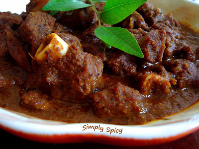

# assignment2-Reddy
This is a second assignment of webapps

# Raghavendra Reddy
###### Mutton curry

Mutton curry is a dish that is made from **Goat Meat**. It is usually served **with rice or with Indian bread**. I like this dish as the the gravy yielded from the slow cooking of the meat along with the bones is rich with the spices and very delicious.

***

#### How to cook mutton curry

1. Marinate lamb with yogurt, red chilli powder, turmeric powder, cumin powder, coriander powder, and salt.
2. Mix everything well and keep it aside for about 2 hours.
3. Heat oil in a heavy bottomed pan and add cloves, cardamoms, bay leaves, garlic, ginger and saute for a few seconds.
4. Add chopped onion, green chillies and saute them till they turn golden brown.
5. Add in the marinated lamb and cook it till the lamb is cooked and tender.
6. Once it is done, add in the tomatoes and green chillies. Cook it for about 15 to 20 minutes.
7. After 15 to 20 minutes, add in the required water and let it cook for 5 minutes more.
8. Sprinkle garam masala and cook for another 3-4 minutes. Once it is done, switch off the stove and garnish it with chopped coriander leaves.
9. Serve the dish with the any of the following:
    1. Steamed rice.
    2. Rumali Roti.
    3. Naan.
    4. paratha.
10. Required ingredients for the recipe
    * 500 grams Mutton.
    * 2 Onions , finely chopped.
    * 3/4 cup Curd (Dahi / Yogurt).
    * Sunflower Oil , as required.
    * Below Spices
        * Cloves.
        * Cumin powder.
        * Bay leaves.

**[About me](AboutMe.md)**

***

### List of places recommended to visit in the karnataka state of india
|Location|No of hours|Money required|
|:------:|:---------:|:------------:|
|[Kodagu](Images/coorgg.jpg)|36|200$|
|[Gokarna](Images/Gokarna.jpg)|8|50$|
|[Bangalore](Images/Bangalore.jpg)|20|100$|
|[Mysore](Images/Mysore.jpg)|20|150$|
|[Hampi](Images/Hampi.jpg)|25|100$|
|[Chickmaglur](Images/chickmaglur.jpg)|12|60$|

***

### Quotes

> Swaraj is my birth right and I shall have it.
                            *Bal Gangadhar Tilak*

>Don't take rest after your first victory because if you fail in second, more lips are waiting to say that your first victory was just luck.
                            *A. P. J. Abdul Kalam*

***

### Go Programming Language
>Go is a statically typed, compiled programming language designed at Google by Robert Griesemer, Rob Pike, and Ken Thompson. Go is syntactically similar to C, but with memory safety, garbage collection, structural typing, and CSP-style concurrency. The language is often referred to as Golang because of its domain name, golang.org, but the proper name is Go.

[Go Lang Wiki](https://en.wikipedia.org/wiki/Go_(programming_language))

##### Sample source code
``` 
package main

import (
	"fmt"
	"os"
	"strconv"
)

func ack(n, m int64) int64 {
	for n != 0 {
		if m == 0 {
			m = 1
		} else {
			m = ack(n, m-1)
		}
		n = n - 1
	}
	return m + 1
}

func main() {
	if len(os.Args) > 2 {
		ia1, _ := strconv.ParseInt(os.Args[1], 10, 0)
		ia2, _ := strconv.ParseInt(os.Args[2], 10, 0)
		fmt.Println(ack(ia1, ia2))
	}
}
```
[Code Reference](https://github.com/SimonWaldherr/golang-examples/blob/master/beginner/ackermann.go)


